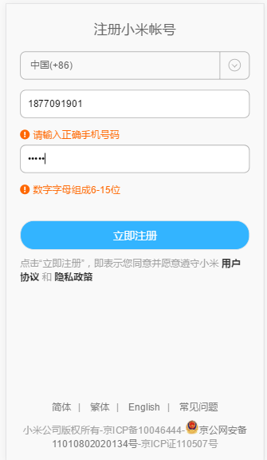
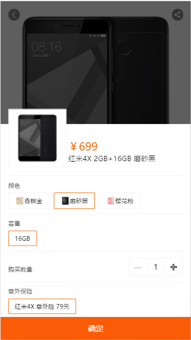
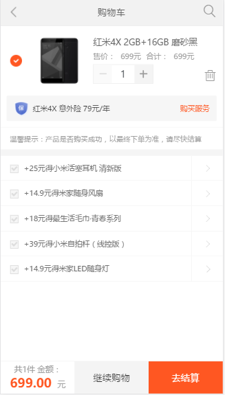

>自己模拟写一个小米移动端官网，并实现基本的陈列在售商品，登录注册，
查看各个商品详情，添加到购物车，查看购物等基本功能。

### 项目描述

- flexible解决移动端各种设备适配问题。
- 主要完成登陆注册页面，购买详情页页面，购物车页面，数据存入localstorage。
- 把html文件转换成ejs模板，用node.js的express框架构建路由把它们整合到一起，把ejs模板渲染到页面上，用路由中间件做一个路由表实现各个页面的跳转以及数据传输。

# 功能展示展示

### 项目运行

进入项目目录
npm install
npm run dev
